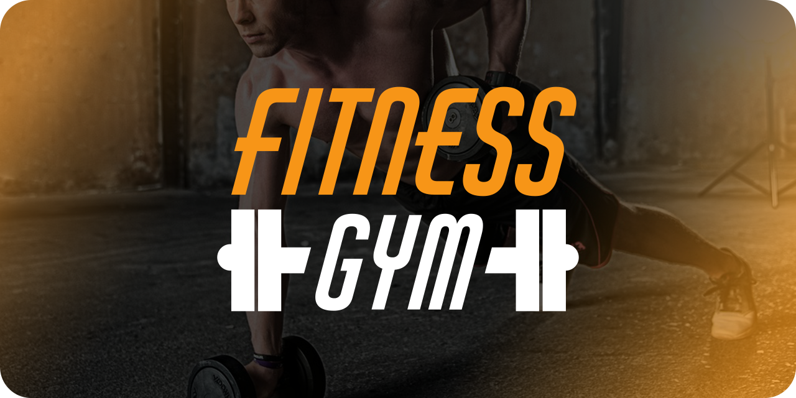
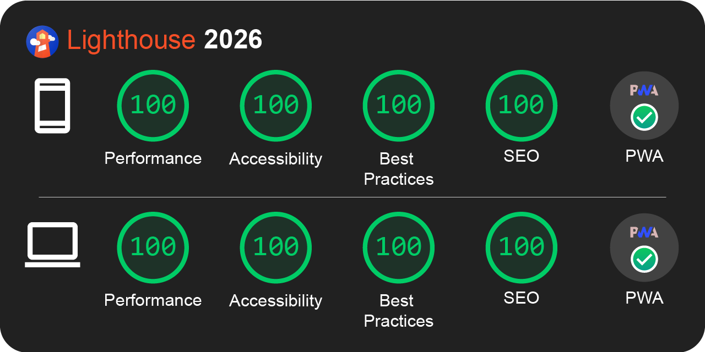

<h1 align="center"> 🔸 💪 Fitness Gym 🦵 🔸 </h1>


## 📑 Table of Contents

- [📑 Table of Contents](#-table-of-contents)
- [📖 Overview](#-overview)
- [🛠️ Technologies](#-technologies)
- [⚡ Performance & PWA](#-performance--pwa)
- [🚀 Demo](#-demo)
- [📦 Install and Use](#-install-and-use)
- [📂 File Structure](#-file-structure)
- [🎨 Reference & Inspiration](#-reference--inspiration)
- [👨‍💻 Author and Contact](#-author-and-contact)

## 📖 Overview

Fitness Gym is a high-performance Progressive Web App (PWA) developed to showcase modern application automation workflows and advanced offline caching strategies. The project's core focus is to deliver a fluid interface with minimal loading times and total availability without a network connection.

## 🛠 Technologies

The following technologies were used to build this project:

- [HTML5](https://developer.mozilla.org/en-US/docs/Web/HTML)
- [CSS3](https://developer.mozilla.org/en-US/docs/Web/CSS)
- [Javascript](https://developer.mozilla.org/en-US/docs/Web/JavaScript)
- [Gulp](https://gulpjs.com/)
- [Node.js](https://nodejs.org/pt-br)
- [PWA](https://web.dev/learn/pwa/)

* **CSS Architecture:** BEM (Block Element Modifier) & Atomic Design principles.
* **Automation:** Gulp.js to minify, concatenate, and inject critical CSS and Javascript.

## ⚡ Performance & PWA



* **Smart Caching Strategy** (Service Worker with obsolete asset deletion).
* **Optimized images** via Gulp (WebP) and lazy loading.
* **Critical CSS injection** to reduce First Contentful Paint (FCP) 

## 🚀 Demo

Access the live application below to interact with the interface and run your own performance tests

Fitness Gym: [https://fitness-gym-pearl.vercel.app/](https://fitness-gym-pearl.vercel.app/)

#### Desktop
[desktop.webm](https://github.com/user-attachments/assets/09fd8433-29a6-4de3-9f4c-fb8df3549af4)

#### Mobile
[mobile.webm](https://github.com/user-attachments/assets/1ae8735a-1ace-41ed-9c71-97e8801f367e)

## 📦 Install and Use

**Prerequisites:** Node.js (v22.x) or higher installed.

1. Clone the repository:
```bash
git clone https://github.com/Epiled/fitness-gym.git
cd fitness-gym
```
2. Install the dependencies:
```bash
npm install
```

3. Run the development environment (Build + Watch + Server):
```bash
gulp serve
```
or
```bash
npm run server
```

4. (Optional) Generate minified build for production:
```bash
gulp build
```
or
```bash
npm run build
```

> **Note:** To update `vercel.json` with the latest asset hashes for deployment, run:
```bash
npm run hash:build
```

## 📂 File Structure

Below is the project architecture. All development should be done inside the `src/` folder. The `dist/` folder is automatically generated by Gulp and should not be edited manually.

```text
fitness-gym/
├── design/                  # Wireframes, videos and assets for documentation
├── src/                     # Main source code (Development)
│   ├── assets/              # Original images and icons
│   ├── css/                 # Styles following architecture BEM and Atomic Design principles
│   ├── js/                  # UI logic and PWA registration
│   ├── icons-preview.html   # Preview page for the custom icon font
│   ├── index.html           # Base semantic structure and main markup
│   ├── manifest.webmanifest # PWA installation settings (App Icon, Colors)
│   ├── robots.txt           # Guidelines for search engine indexing (SEO)
│   └── sw-template.js       # Service Worker Template (hashes injected by Gulp)
├── dist/                    # Production build (Generated by Gulp - DO NOT EDIT)
├── gulpfile.js              # Automation pipeline (Minification and optimization tasks)
└── package.json             # Project dependencies and npm scripts
```

## 🎨 Reference & Inspiration

The project's design and wireframes are available for viewing on Figma. Below is a list of the real-world examples that inspired the UI/UX design.

Figma / Wireframe: [Fitness Gym](https://www.figma.com/design/FodXub9KWw9YjUF2Zfl1GZ/Fitness-Gym?node-id=0-1&t=BbKVdxXdebEzU0Xh-1)

### Inspiration

* [SmartFit](https://www.smartfit.com.br/?gclid=Cj0KCQjwjt-oBhDKARIsABVRB0wsnAjS--OiIMrzNjklx9nR3w0rXAZM46lWLefnmjgkCP2UW0fC0EEaApkPEALw_wcB)
* [Panobianco](https://www.panobiancoacademia.com.br/)
* [Koatch](https://www.koatch.com/)

## 👨‍💻 Author and Contact

<a href="https://github.com/Epiled">
  
  <br />
  <sub><b>Felipe De Andrade</b></sub>
</a>

Made with ❤️ by Felipe De Andrade 👋🏽 Get in touch!

[](https://www.linkedin.com/in/fademendonca/)
[](https://codepen.io/epiled)
[](mailto:felipe.deam98@gmail.com)
